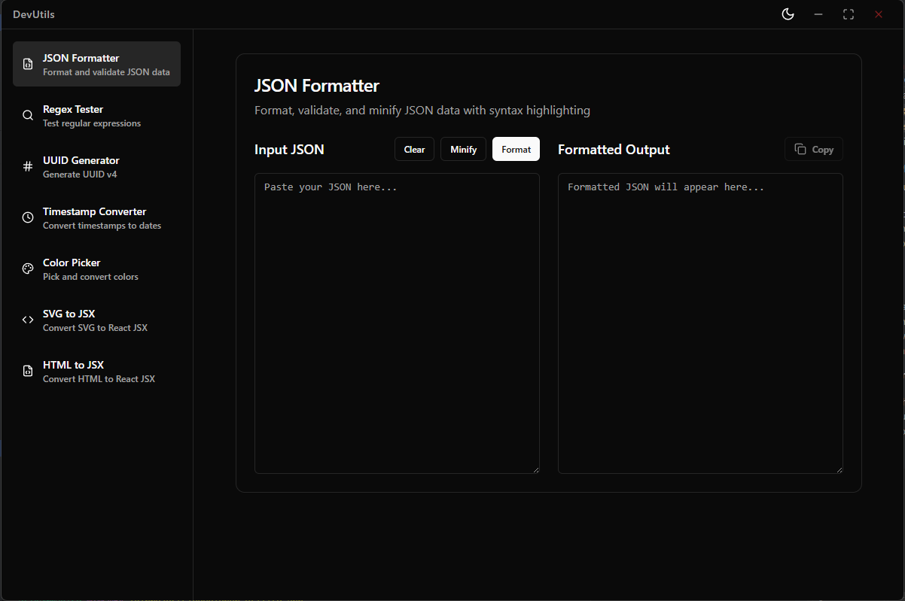

# DevUtils - Developer Utility Tools

A collection of essential developer utility tools built with Electron, React, and TypeScript.



## 🚀 Features

- **JSON Formatter** - Format, validate, and prettify JSON data
- **Regex Tester** - Test regular expressions with real-time matching
- **UUID Generator** - Generate various types of UUIDs
- **Timestamp Converter** - Convert between different timestamp formats
- **Color Picker** - Pick colors and convert between different color formats
- **HTML to JSX** - Convert HTML code to JSX format
- **SVG to JSX** - Convert SVG code to JSX components

## 📋 System Requirements

- Windows 10 or later (64-bit)
- macOS 10.13 or later (Intel or Apple Silicon) - local builds only
- No additional dependencies required

## 📥 Download

### Latest Release

Download the latest version from the [Releases](https://github.com/ahammadabdullah/dev-utils/releases) page:

- **Windows Installer**: `DevUtils-Setup-{version}.exe` - Full installer with shortcuts
- **Windows Portable**: `DevUtils-Portable-{version}.exe` - Portable version, no installation required

**Note**: macOS builds are supported locally only; no official macOS release is available yet.

## 🔧 Installation

### Windows Installer Version

1. Download `DevUtils-Setup-{version}.exe`
2. Run the installer
3. Follow the installation wizard
4. Launch DevUtils from the Start Menu or Desktop shortcut

### Windows Portable Version

1. Download `DevUtils-Portable-{version}.exe`
2. Run the executable directly — no installation needed
3. The app will run immediately

### macOS Local Build
To build DevUtils for macOS locally:

#### Prerequisites
- You must be on macOS (cannot cross-build from Windows/Linux).

- Node.js (LTS) and npm installed.

- Xcode Command Line Tools installed:
```bash
xcode-select --install
```

#### Commands

**Generate icons (required before packaging):**
```bash
npm run generate:icons
```

**Build and package** (two options):

1. Single-step build and package
```bash
npm run build:release:mac
```

2. Manual two-step
```bash
npm run build
npm run dist:mac
```
The packaged `.dmg` file will be available inside the `release/` directory.

Unsigned local builds may show Gatekeeper warnings.

#### Notes

- Builds target both x64 and arm64 architectures

- Minimum supported macOS version: 10.13

- Uses Hardened Runtime and `config/entitlements.mac.plist` for signing

#### Troubleshooting

- Error: "macOS builds can only be run on macOS" → You are attempting to build on Windows/Linux

- Missing icons/assets → Re-run:
```bash
npm run predist:mac
```


## 🛠️ Development

This project is built with:

- **Electron** - Desktop app framework
- **React 18** - UI framework
- **TypeScript** - Type safety
- **Vite** - Build tool
- **Tailwind CSS** - Styling
- **shadcn/ui** - UI components

### Building from Source

```bash
# Clone the repository
git clone https://github.com/ahammadabdullah/dev-utils.git
cd dev-utils

# Install dependencies
npm install

# Run in development mode
npm run dev
npm run electron

# Build for production
npm run build:release
```

## 🤝 Contributors

<!-- ALL-CONTRIBUTORS-LIST:START - Do not remove or modify this section -->
<!-- prettier-ignore-start -->
<!-- markdownlint-disable -->
<table>
  <tbody>
    <tr>
      <td align="center" valign="top" width="14.28%"><a href="http://builtbypiyush.me"><br /><sub><b>Piyush dixit</b></sub></a><br /><a href="#code-Er-luffy-D" title="Code">💻</a></td>
      <td align="center" valign="top" width="14.28%"><a href="https://github.com/rohandol112"><br /><sub><b>rohandol112</b></sub></a><br /><a href="#code-rohandol112" title="Code">💻</a></td>
      <td align="center" valign="top" width="14.28%"><a href="https://frustateduser.github.io/koustubh.github.io/"><br /><sub><b>KOUSTUBH BADSHAH</b></sub></a><br /><a href="#code-frustateduser" title="Code">💻</a></td>
      <td align="center" valign="top" width="14.28%"><a href="https://github.com/Parthav46"><br /><sub><b>Parthav Patel</b></sub></a><br /><a href="#code-Parthav46" title="Code">💻</a></td>
    </tr>
  </tbody>
</table>

<!-- markdownlint-restore -->
<!-- prettier-ignore-end -->

<!-- ALL-CONTRIBUTORS-LIST:END -->

## 📝 License

This project is licensed under the MIT License - see the [LICENSE](LICENSE) file for details.

## 🐛 Bug Reports & Feature Requests

Found a bug or have a feature request? Please open an issue on the [Issues](https://github.com/ahammadabdullah/dev-utils/issues) page.

## 📊 Changelog

See [CHANGELOG.md](CHANGELOG.md) for a list of changes in each version.

## ⭐ Show your support

Give a ⭐️ if this project helped you!

---

**Note:** Only Windows packages are officially released. macOS builds are supported locally but not yet released.
